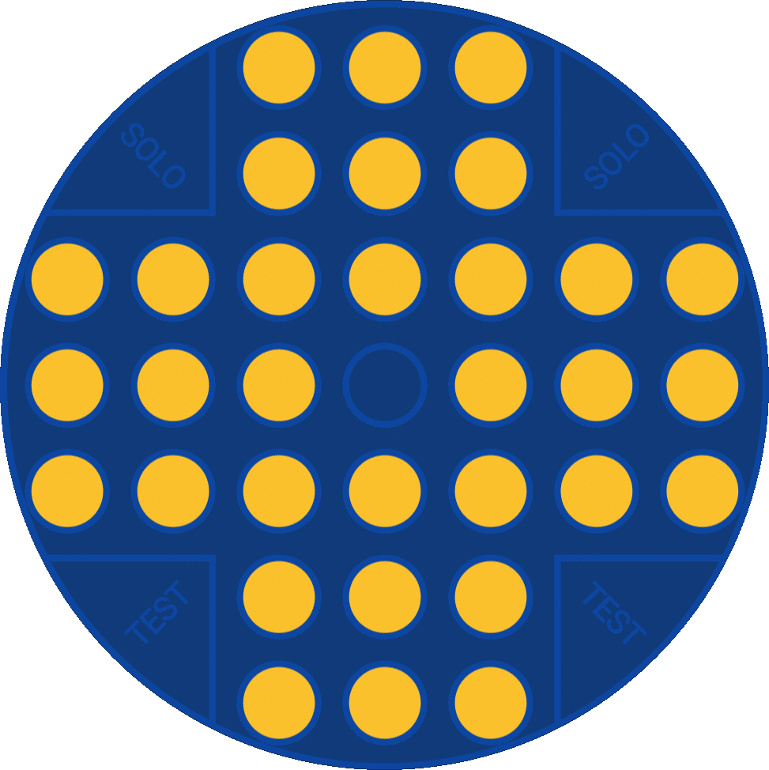

<h1 align="center">SoloTest</h1>
</br>

<p align=center>

</p>
<p align=center>
Solo Test aka Peg Solitaire is a sample app built with Jetpack Compose, which demonstrates various UI elements can be drawn with Canvas API.
</p>

## Download

Go to [Play Store](https://play.google.com/store/apps/details?id=com.yasinkacmaz.solotest) to download the App

Go to [Releases](https://github.com/yasinkacmaz/SoloTest/releases) to download the Apk

## About Game

SoloTest is the name of Peg Solitaire in Turkey. Additionally, SoloTest includes points and letters based on the remaining pegs after the game ends.

SoloTest has rude words for 9, 8 and 7 remaining pegs so I've included them in this app. Please bear in mind if you see rude words.

Checkout [Wikipedia/PegSolitaire](https://en.wikipedia.org/wiki/Peg_solitaire) to learn more.

## Objective

The objective of the game is to empty the board and leave only one peg in the central square.

## How To Play

A valid move is to jump a peg orthogonally over an adjacent peg into a hole two positions away and then to remove the jumped peg.
</br>


## Screenshots

<p>


</p>

## License
```
MIT License

Copyright (c) 2022 Yasin Kaçmaz

Permission is hereby granted, free of charge, to any person obtaining a copy
of this software and associated documentation files (the "Software"), to deal
in the Software without restriction, including without limitation the rights
to use, copy, modify, merge, publish, distribute, sublicense, and/or sell
copies of the Software, and to permit persons to whom the Software is
furnished to do so, subject to the following conditions:

The above copyright notice and this permission notice shall be included in all
copies or substantial portions of the Software.

THE SOFTWARE IS PROVIDED "AS IS", WITHOUT WARRANTY OF ANY KIND, EXPRESS OR
IMPLIED, INCLUDING BUT NOT LIMITED TO THE WARRANTIES OF MERCHANTABILITY,
FITNESS FOR A PARTICULAR PURPOSE AND NONINFRINGEMENT. IN NO EVENT SHALL THE
AUTHORS OR COPYRIGHT HOLDERS BE LIABLE FOR ANY CLAIM, DAMAGES OR OTHER
LIABILITY, WHETHER IN AN ACTION OF CONTRACT, TORT OR OTHERWISE, ARISING FROM,
OUT OF OR IN CONNECTION WITH THE SOFTWARE OR THE USE OR OTHER DEALINGS IN THE
SOFTWARE.
```
